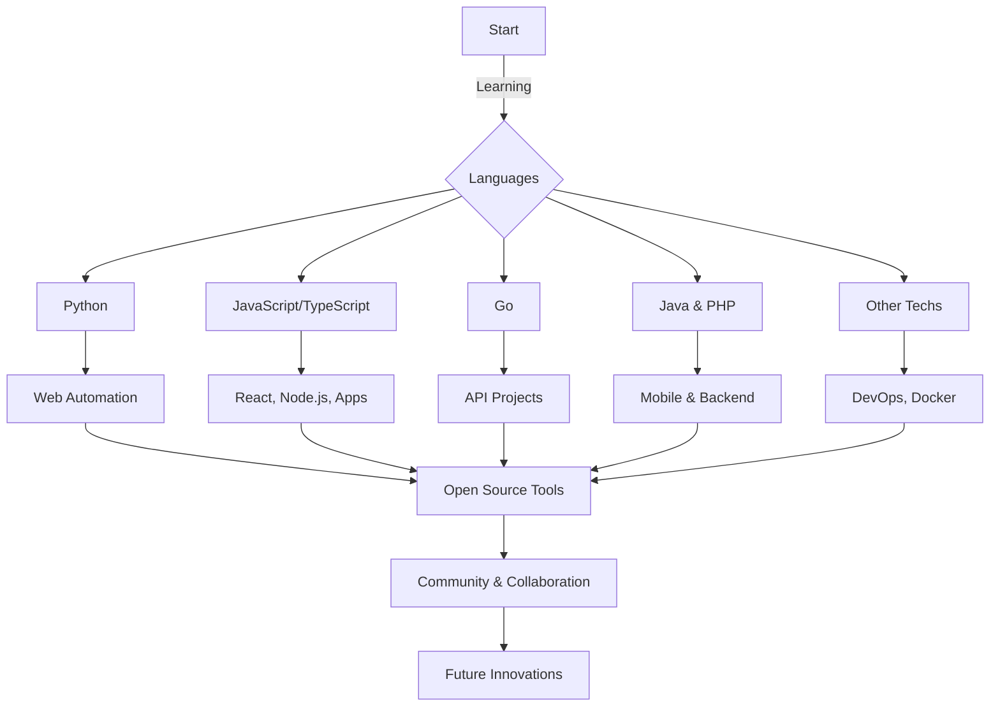

<h1 align="center">Hi there, I'm FruatreMaou 👋</h1>

  

  

---

  
  
  
  

---

## 🌍 About Me

Hi! I'm FruatreMaou, a passionate developer who loves to explore, create, and collaborate. My journey in tech has led me across multiple languages and frameworks, from backend to frontend, from mobile to web, and even a bit of automation and AI.  
I'm always eager to learn, share, and connect with fellow creators!

---

## 💬 Languages & Technologies

  
  
  
  
  
  
  
  
  
  
  
  
  
  
  
  

---

## 🛠️ What I Do

- 💡 **Fullstack Development:** Web, mobile, desktop—let's code everywhere!
- ⚡ **Automation & Bots:** Making life easier, one script at a time.
- 📦 **Open Source Projects:** Love to contribute and create tools for the community.
- 🌐 **Multi-language Repos:** Projects in Python, JS/TS, Go, Java, PHP, and more.
- 🤖 **AI & Machine Learning:** Diving into the future of tech.
- 🎨 **Design & UI/UX:** Because good code deserves a great look.

---

## 🚩 Featured Projects

- [Awesome-Bot](https://github.com/FruatreMaou/awesome-bot) — Automation WhatsApp & Telegram
- [Portofolio-Website](https://github.com/FruatreMaou/portofolio-website) — Modern, responsive, and interactive
- [AI-Challenge](https://github.com/FruatreMaou/ai-challenge) — Machine Learning & Deep Learning Examples

---

## 📈 GitHub Stats

  
  

  
  

---

## 📖 Guestbook

Leave a comment or message on [Discussions](https://github.com/FruatreMaou/FruatreMaou/discussions) — I love hearing from you!

---

## 🌏 Connect with Me

<table>
  <tr>
    <td><b>WhatsApp</b></td>
    <td>
      <a href="https://wa.me/6285817597752" target="_blank">+62 858-1759-7752</a>
    </td>
  </tr>
  <tr>
    <td><b>Instagram</b></td>
    <td>
      <a href="https://instagram.com/miesedap_7" target="_blank">@miesedap_7</a>
    </td>
  </tr>
  <tr>
    <td><b>WhatsApp Channel</b></td>
    <td>
      <a href="https://whatsapp.com/channel/0029VaNR2B6BadmioY6mar3N" target="_blank">Join Channel</a>
    </td>
  </tr>
</table>

---

## 🎲 Fun Facts

- 🌎 Pernah ngoding sambil berak.
- ☕ Kopi adalah sahabat setia saat ngoding.
- 🎵 Combinasi Music Hip-hop pas lagi nyusun kode itu mantap wok.

---

## 🧭 My GitHub Journey

---

## 💡 Quotes & Inspiration

> "Code is like humor. When you have to explain it, it’s bad." – Cory House  
> “Stay Hungry, Stay Foolish.” – Steve Jobs

---

  

  <b>Let’s connect, collaborate, and create something amazing together!</b>

